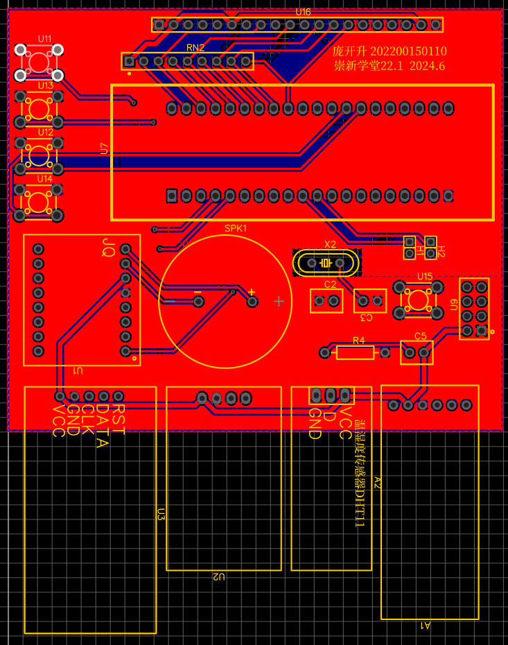
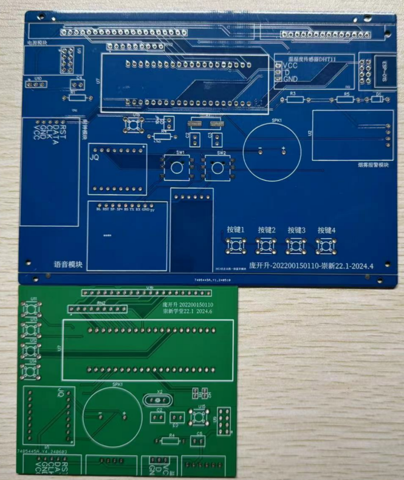

# Electronic Music Perpetual Calendar 🕰️📅
## 外观展示⏰

 

欢迎来到 Electronic Music Perpetual Calendar 项目！本项目基于 [Smart-Calendar-Clock](https://github.com/genglinWang/Smart-Calendar-Clock) 进行了全面优化与功能扩展，打造了一款融合物联网与智能交互的创新硬件产品。

> 📜 本项目为山东大学信息学院《开放性创新实践Ⅰ—硬件》课程成果

## 项目亮点 ✨✨✨

### 全栈式开发闭环
🖨️ **3D打印一体化外壳** - SolidWorks建模实现物理按键与PCB板完美嵌合  
🔩 **双版本PCB迭代** - 从15x10cm优化至8.6x7.4cm，支持背焊式按键设计  
🔥 **火灾应急系统** - MQ-2烟雾传感器+短信报警双保险机制  

### 功能全景图
📅 **日历系统**  
- 公历/农历双模式 | 二十四节气 | 星期显示 
- 事件提醒（生日/会议/作业）⏰ 提前1天弹窗预警  
- 闹钟时间设置，闹钟时间到进行声光报警提示🚨

🌡️ **环境感知**  
- DHT11温湿度实时监测  
- 蓝牙天气同步（晴/雨/多云等8种状态）
- MQ-2烟雾传感器🔥+短信✉️报警双保险机制  

🎵 **智能交互**  
- 手机APP进行时间调整、事项提醒、天气更新
- JQ8900音乐芯片支持6首闹铃可选  
- MIT App Inventor开发跨平台控制APP  

 

## 硬件架构 📐
### 原理图

 

### 3D打印效果图

 

### PCB设计效果图

### 核心模块清单
| 模块 | 型号 | 特性 |
|------|------|------|
| MCU | STC12C5A6052 | 低功耗高速8051内核 |
| 时钟 | DS1302 | 纽扣电池供电持续计时 |
| 显示 | LCD12864 | 自定义汉字库支持 |
| 音乐 | JQ8900-16P | 播放自定义铃声 |
| 通信 | HC-05蓝牙 | 安卓/iOS全平台兼容 |
| 传感器 | MQ-2+DHT11 | 火灾/温湿度双重监测 |

### PCB进化史

 

- **V1痛点**：WIFI/蓝牙冲突 | 布局冗余 | 供电不稳  
- **V2突破**：精简模块位置 | 背焊式按键设计 | 与3D打印结合

## 项目开发流程 🛠️

### 1. 原理图设计 📐
利用 **Altium Designer** 设计该系统的原理图：
- **模块化设计**：将系统分为MCU、时钟、传感器、显示、通信等模块。
- **电平转换**：在WIFI_RX处添加电平转换设计，确保信号稳定性。
- **模块选择**：
  - MCU：STC12C5A6052
  - 时钟：DS1302
  - 传感器：MQ-2（烟雾）、DHT11（温湿度）
  - 显示：LCD12864
  - 通信：HC-05（蓝牙）、ESP-01（WiFi）
  - 电源：AMS1117（5V转3.3V）

### 2. PCB设计 🖨️
利用 **Altium Designer** 设计PCB板图，并委托制板厂家加工：
- **PCB尺寸**：第一版为15x10cm，第二版优化为8.6x7.4cm。
- **线宽设置**：供电和接地线宽为30mil，其余线宽为10mil。
- **文字标识**：在PCB板上添加学号和姓名文字标识。
- **优化改进**：
  - 去掉ESP-01S WiFi模块，避免与蓝牙冲突。
  - 使用排针形式引出TX、RX，解决开关自动复位问题。
  - 加入稳压模块，解决DC供电电压偏差问题。

### 3. 焊接与调试 🔧
焊接元器件并进行实物调试：
- **第一版焊接**：LCD12864显示不稳定，PCB接触不良，通讯复杂。
- **第二版焊接**：焊接效果良好，蓝牙通讯恢复正常，空间利用率高。
- **调试重点**：
  - 确保LCD12864显示稳定。
  - 测试蓝牙、WiFi通信功能。
  - 验证温湿度传感器和烟雾传感器数据准确性。

### 4. 3D打印与外壳制作 🖌️
进行 **3D打印**，制作配套机壳：
- **设计工具**：使用 **SolidWorks** 进行建模。
- **外壳设计**：
  - 创建基本外壳，添加显示屏、按钮、烟雾传感器的开口。
  - 调整外壳厚度，添加圆角，增强美观性和结构强度。
- **按钮设计**：从背面焊接按钮，搭配3D打印外壳，实现原始触发且灵敏。
- **固定方式**：使用热熔胶固定内部元件，确保稳固性。

### 5. 设计报告编写 📄
编写设计报告，包含软硬件设计思路和效果展示：
- **硬件设计**：
  - 原理图设计思路。
  - PCB布局优化过程。
  - 焊接调试问题与解决方案。
- **软件设计**：
  - 蓝牙连接逻辑。
  - 时间、闹钟设置功能实现。
  - 事件提醒与天气显示逻辑。
- **效果展示**：
  - 3D外壳效果图。
  - 功能演示截图（时间显示、温湿度检测、闹钟设置等）。
  - 手机APP界面截图。